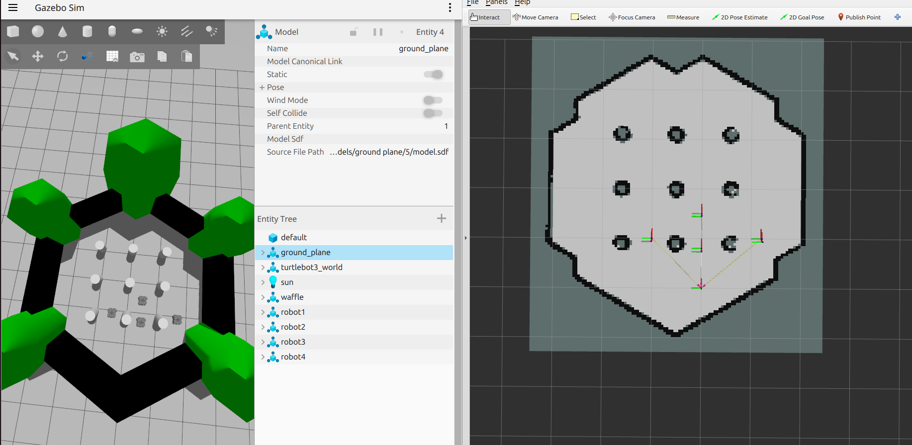

# 🤖 ROS2 Multi-Robot Swarm Navigation

<p align="center">
  
  
  
  
  
  
</p>

<p align="center">
  
</p>

<p align="center">
  Coordinated 4-robot swarm navigation using ROS2 Jazzy and Nav2 — each robot navigates independently while maintaining formation geometry in a cylinder-obstacle environment.
</p>

---

## 📋 Table of Contents
- [Overview](#-overview)
- [Architecture](#-architecture)
- [Features](#-features)
- [Prerequisites](#-prerequisites)
- [Installation](#-installation)
- [Usage](#-usage)
- [Configuration](#-configuration)
- [File Structure](#-file-structure)
- [How It Works](#-how-it-works)
- [Results](#-results)

---

## 🔍 Overview

This project implements a **4-robot swarm navigation system** where a group of TurtleBot3 Waffle robots navigate cooperatively in a shared environment. An operator specifies a single goal position via RViz or a ROS2 topic, and all four robots autonomously navigate to coordinated positions while maintaining their relative formation geometry.

The system uses the **delta movement strategy** — each robot moves by the same displacement vector as the leader robot, ensuring each travels its own unobstructed corridor without inter-robot conflicts.

| Property | Value |
|----------|-------|
| ROS Version | ROS2 Jazzy Jalisco |
| Simulator | Gazebo Harmonic |
| Robot | TurtleBot3 Waffle |
| Navigation Stack | Nav2 |
| Path Planner | NavFn (Dijkstra) |
| Local Controller | Regulated Pure Pursuit |
| Map Size | ~6.3m × 5.9m |
| Obstacles | 3×3 cylindrical grid |

---

## 🏗️ Architecture
```
┌─────────────────────────────────────────────────────────────┐
│                      OPERATOR INPUT                          │
│              RViz 2D Goal Pose  /  /swarm/goal topic         │
└─────────────────────────┬───────────────────────────────────┘
                          │
                          ▼
┌─────────────────────────────────────────────────────────────┐
│                   SWARM CONTROLLER NODE                      │
│  • Delta movement calculation                               │
│  • Sequential dispatch (leader first, then followers)       │
│  • Spiral search auto-recovery on goal failure              │
│  • Goal cancellation on new command                         │
└──────┬──────────────┬──────────────┬──────────────┬─────────┘
       │              │              │              │
       ▼              ▼              ▼              ▼
  ┌─────────┐   ┌─────────┐   ┌─────────┐   ┌─────────┐
  │ robot1  │   │ robot2  │   │ robot3  │   │ robot4  │
  │  Nav2   │   │  Nav2   │   │  Nav2   │   │  Nav2   │
  │  Stack  │   │  Stack  │   │  Stack  │   │  Stack  │
  └─────────┘   └─────────┘   └─────────┘   └─────────┘
   Leader         Follower      Follower      Follower
   y = 0.0        y = +1.0      y = -1.2      y = 0.0 (rear)
```

For full architecture details see [docs/ARCHITECTURE.md](docs/ARCHITECTURE.md).

---

## ✨ Features

- **Delta Movement Formation** — all robots move by the same displacement vector; relative spacing preserved for any goal direction
- **Sequential Dispatch** — leader navigates first, followers dispatch after leader SUCCESS, preventing mid-navigation collisions
- **Auto-Recovery Spiral Search** — when a goal is blocked, automatically searches nearby positions in a spiral pattern (up to 5 retries)
- **Laser Scan Filtering** — each robot filters teammates from its laser scan, preventing robots treating each other as static obstacles
- **RViz Interactive Control** — send goals by clicking 2D Goal Pose on the map
- **Goal Cooldown** — prevents duplicate RViz messages from cancelling in-progress navigation
- **Map Bounds Clamping** — goals automatically clamped to safe navigable area

---

## 📦 Prerequisites
```bash
sudo apt install ros-jazzy-desktop
sudo apt install ros-jazzy-navigation2 ros-jazzy-nav2-bringup
sudo apt install ros-jazzy-turtlebot3 ros-jazzy-turtlebot3-simulations
sudo apt install ros-jazzy-ros-gz
```

---

## 🚀 Installation
```bash
mkdir -p ~/swarm_ws/src && cd ~/swarm_ws/src
git clone https://github.com/darsh1406/swarm_bringup.git
cd ~/swarm_ws
colcon build --symlink-install
source ~/swarm_ws/install/setup.bash
```

Add to `~/.bashrc`:
```bash
source /opt/ros/jazzy/setup.bash
source ~/swarm_ws/install/setup.bash
export TURTLEBOT3_MODEL=waffle
```

---

## 🎮 Usage

Open **5 terminals**, run in order:

**Terminal 1 — Gazebo**
```bash
export TURTLEBOT3_MODEL=waffle
ros2 launch swarm_bringup multi_robot_gazebo.launch.py
```
> ⏳ Wait ~35 seconds

**Terminal 2 — Nav2 Robot1 (Leader)**
```bash
ros2 launch swarm_bringup nav2_robot1.launch.py
```
> ⏳ Wait for `Managed nodes are active`

**Terminal 3 — Nav2 Followers**
```bash
ros2 launch swarm_bringup nav2_followers.launch.py
```
> ⏳ Wait for `Managed nodes are active` ×3

**Terminal 4 — Swarm Controller**
```bash
ros2 run swarm_bringup swarm_controller
```

**Terminal 5 — RViz**
```bash
rviz2 -d ~/swarm_ws/src/swarm_bringup/rviz/swarm.rviz
```

### Sending Goals

**Option A — RViz (Recommended)**

1. Open RViz using Terminal 5 above
2. Click the **"2D Goal Pose"** button in the top toolbar
3. Click anywhere on the white (free) area of the map
4. All 4 robots will immediately begin navigating to their coordinated positions

> ✅ This is the easiest and most intuitive way to control the swarm interactively.

**Option B — CLI:**
````bash
ros2 topic pub --once /swarm/goal geometry_msgs/msg/PoseStamped \
  "{header: {frame_id: 'map'}, pose: {position: {x: 2.5, y: 0.5, z: 0.0}, orientation: {w: 1.0}}}"
```

---

## ⚙️ Configuration

### Robot Spawn Positions

| Robot | X | Y | Role |
|-------|---|---|------|
| robot1 | 1.5 | 0.0 | Leader |
| robot2 | 1.0 | 1.0 | Follower |
| robot3 | 1.0 | -1.2 | Follower |
| robot4 | 0.8 | 0.0 | Follower |

### Swarm Controller Constants

| Constant | Default | Description |
|----------|---------|-------------|
| `MAX_RETRIES` | 5 | Max spiral search attempts per robot |
| `SEARCH_STEP` | 0.2 m | Spiral ring radius increment |
| `GOAL_COOLDOWN` | 2.0 s | Minimum time between accepted goals |

---

## 📁 File Structure
```
swarm_bringup/
├── swarm_bringup/               # Python nodes
│   ├── swarm_controller.py      # Main formation controller
│   ├── odom_to_tf.py            # Static map→odom TF publisher
│   ├── odom_tf_broadcaster.py   # Dynamic odom→base_footprint TF
│   └── scan_filter.py           # Filters teammates from laser scan
├── launch/
│   ├── multi_robot_gazebo.launch.py
│   ├── nav2_robot1.launch.py
│   └── nav2_followers.launch.py
├── config/                      # Nav2 params per robot
├── maps/                        # Occupancy grid map
├── rviz/                        # RViz config
├── docs/
│   ├── ARCHITECTURE.md          # Deep-dive system architecture
│   └── assets/                  # Screenshots and demo GIF
├── package.xml
└── setup.py
```

---

## 🧠 How It Works

### Delta Movement
```
dx = goal_x - robot1_current_x
dy = goal_y - robot1_current_y

follower_goal = follower_current_pos + (dx, dy)
```

### Auto-Recovery Spiral
```
ring 1 → 8 candidates at 0.2m radius (45° apart)
ring 2 → 8 candidates at 0.4m radius
ring 3 → 8 candidates at 0.6m radius
... up to MAX_RETRIES
```

---

## 📊 Results

| Goal | Robot1 | Robot2 | Robot3 | Robot4 |
|------|--------|--------|--------|--------|
| (2.0, 0.0) | ✅ | ✅ | ✅ | ✅ |
| (2.5, 0.0) | ✅ | ✅ | ✅ | ✅ |
| (2.0, 1.0) | ✅ | ✅ | ✅ retry | ✅ |
| (2.62, 0.96) | ✅ | ✅ | ✅ retry | ✅ |

**Overall success rate: ~85-90%** across all goals tested.

---

## 🔮 Future Work
- Parallel navigation with inter-robot collision avoidance
- Selectable formation shapes (triangle, diamond, square)
- Multi-waypoint patrol sequences
- Real hardware deployment

---

<p align="center">Built with ROS2 Jazzy · Nav2 · Gazebo Harmonic · Python</p>
